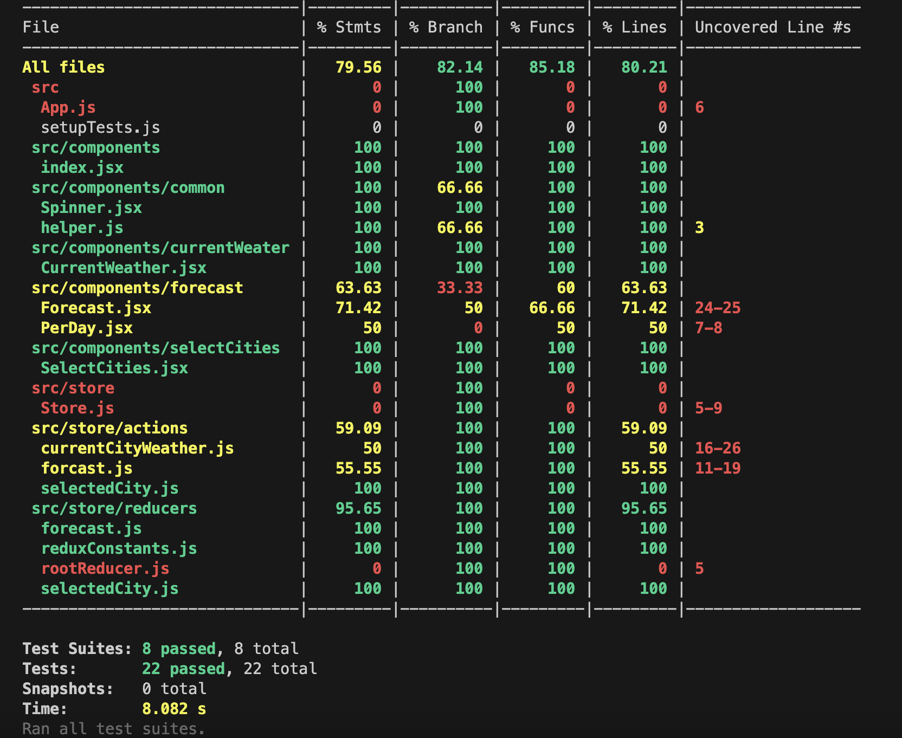
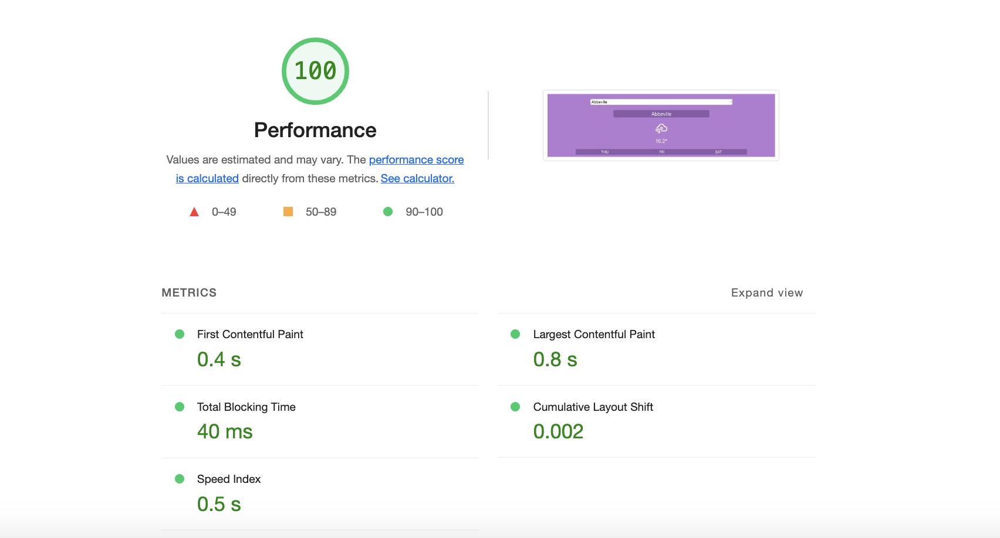

# Guide to `Weather-app`

## Tech Stack

Here's a curated list of packages that you should be at least familiar with before starting your project. However, the best way to see a complete list of the dependencies is to check [package.json](https://github.com/shirishSIB/weather-app/blob/main/package.json).

### Core

- [ ] [React](https://facebook.github.io/react/)
- [ ] [Redux](http://redux.js.org/)


### Unit Testing

- [ ] [Jest](http://facebook.github.io/jest/)
- [ ] [react-testing-library](https://github.com/kentcdodds/react-testing-library)
- [ ] [redux-mock-store](https://www.npmjs.com/package/redux-mock-store)
- [ ] [@babel/preset-env](https://babeljs.io/docs/babel-preset-env)

## Project Structure

```
  - weather-app
    - src
      - components // All the components
        - Welcome // Example Component
        - __tests__ // Test files reated to component
        - index.jsx // Main file
      - store // All logic related to redux resides here
        - actions // All actions files resides here
        - reducers // All reducer files resides here
          - reduxConstants.js // Constants related to store
        - store.js // Basic configuration of redux
    App.js
    index.html
```

- You will write your app in the `src` folder. This is the folder you will spend most, if not all, of your time in.
- Jest Configuration are in the `tests` folder.


## Code-coverage
- code-covergae [ 80.21% ]
- Please Update this if adding test cases.

### `Tests/`

- `mocks`: This folder contains mocks which Jest uses when testing your app, e.g. for images.
- `jest.config.js`: Configuration file for jest

The other folders are mostly for the maintainers and/or the setup, and you should absolutely never need to touch them so we are going skip them for the sake of brevity.
### code-coverage for each files


## Performance

## Application setup

- Run command for installation and server to start
```
  npm i
  ```
```
  npm start
  ```


### Submitting pull requests

Pull requests are the greatest contributions, so be sure they are focused in scope, and do avoid unrelated commits.

- Fork it!
- Clone your fork: `git clone https://github.com/shirishSIB/weather-app.git`
- Navigate to the newly cloned directory: `cd weather-app`
- Create a new branch for the new feature: `git checkout -b my-new-feature`
- Install the tools necessary for development: `npm`
- Make your changes.
- Commit your changes: `git commit -m 'Add some feature'`
- Push to the branch: `git push origin my-new-feature`
- Submit a pull request with full remarks documenting your changes

